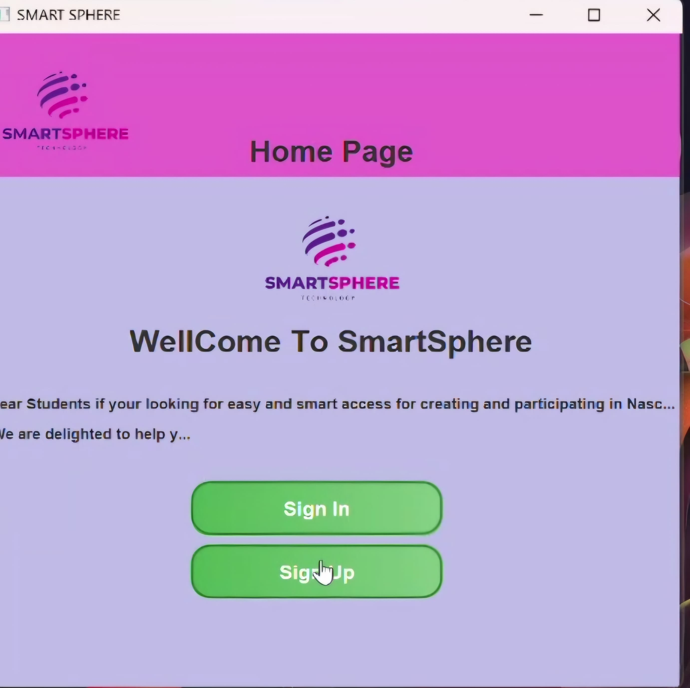
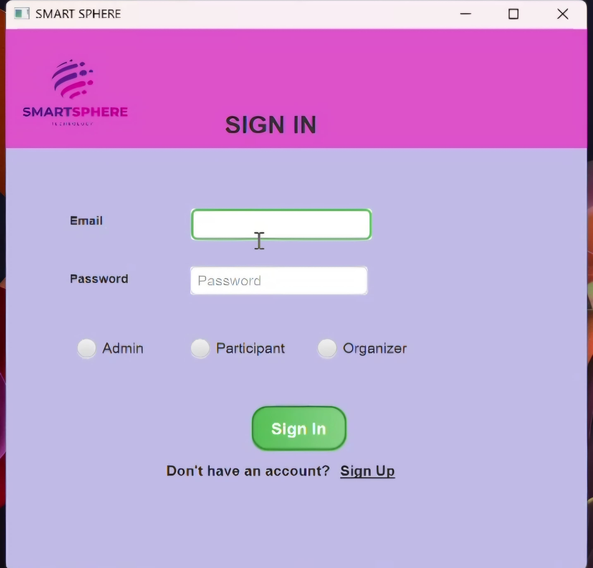
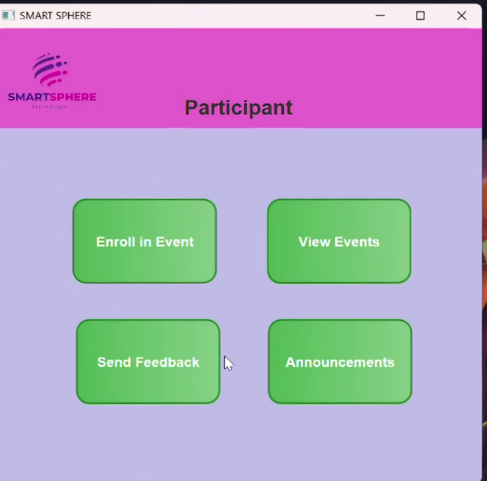
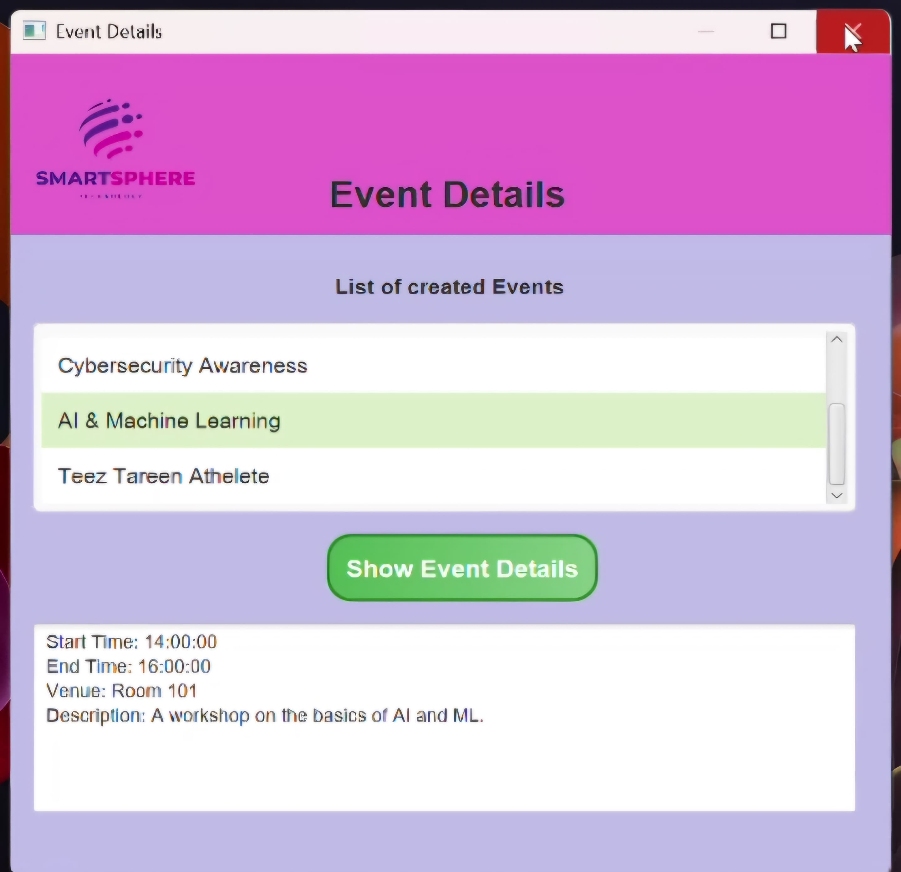

# NASCON Event Management System

## Overview

The NASCON Event Management System is a desktop application designed and developed for FAST University Islamabad to manage events, specifically for NASCON. This system provides a user-friendly interface for organizers, participants, and administrators to efficiently handle various event-related tasks. The application is built using JavaFX for the front-end, Java for the back-end logic, and Oracle for database management.

## Features

Based on the use case diagram, the system delivers the following functionalities:

**For Participants:**

* **Login:** Participants can log in to the system.
* **View Event Details:** Participants can view details of events.
* **Enroll in Events:** Participants can enroll themselves in events.
* **Send Feedback:** Participants can send feedback regarding events.
* **View Notifications:** Participants can view event-related notifications.

**For Organizers:**

* **Login:** Organizers can log in to the system.
* **Create Events:** Organizers can create new events.
* **Modify Events:** Organizers can modify existing events.
* **View Event Details:** Organizers can view details of events.
* **Add Announcements:** Organizers can add announcements related to events.
* **View Feedback Report:** Organizers can view feedback reports for events.

**For Administrators:**

* **Register New User:** Administrators can register new users (organizers, participants).
* **Generate Reports:** Administrators can generate reports related to events and user activities.

## Technology Used

* **Front-end:** JavaFX (FXML)
* **Back-end:** Java
* **Database:** Oracle

## Screenshots

Here are some screenshots of the application:

* **SS1: Home Screen**
    

        
    

* **SS2: Sign in Screen**
    

        
    

* **SS4: Participant Home Page**
    

        
    

* **SS5: Event Details Form**
    

        
    

## How to Run the Application

1.  **Prerequisites:**
    * Java Development Kit (JDK) installed.
    * Oracle Database set up and running.
2.  **Installation:**
    * Clone the repository.
    * Set up the Oracle database and configure the connection properties in the application.
    * Import the project into your preferred Java IDE (e.g., IntelliJ IDEA, Eclipse).
    * Build the project.
    * Run the main class to launch the application.

## Documentation

(You can add more details about the system architecture, database schema, etc., if you have them.)

## Contribution

(If you want to allow others to contribute to your project, add contribution guidelines here.)

## License

(Specify the license under which your project is released.)

## Acknowledgements

* FAST University Islamabad
* (Any other individuals or resources you want to acknowledge)
